# MY LISTS — COMPLETE UI/UX, CONSISTENCY & FRONTEND SIMPLIFICATION AUDIT

**Target Repository**: `https://github.com/Br0ck25/My-Lists`  
**Test Deployment**: `https://mylistsbeta.jamesbrock25.workers.dev/`  
**Audit Date**: September 2026  
**Auditor Roles**: Senior UI/UX Designer, Product Designer, Frontend Architect, Accessibility Specialist, Usability Researcher  

---

## 1. Executive Summary

### Is the current UI easy to understand?
**No.** For a first-time visitor, My Lists presents an overwhelming wall of domain-specific jargon, overlapping navigation categories, and hundreds of competing controls before answering the basic question: *"What is this and how do I get movies and TV shows onto my Stremio/Wako home screen?"* 

A new user landing on the site is confronted with:
- Six top-level tabs plus up to 8 sub-navigation pills per tab.
- Unexplained distinctions between **"Catalogs"**, **"Lists"**, and **"Channels"** (which all ultimately produce Stremio catalog rows).
- Unclear dual concepts like **"Discover"** vs. **"Catalogs → Quick Add"** vs. **"Channels → Storylines"** (all of which browse and add curated collections).
- An interactive live preview shelf simulating Stremio that competes with actual configuration inputs.

### Is it consistent?
**No.** While the visual skin has a modern dark-mode aesthetic with Apple/iOS-inspired tokens (`--radius: 14px`, SF Pro / Inter fonts, translucent backdrops), the underlying interaction design is heavily fragmented:
- **124 blocking browser `alert()` dialogs**, **18 native `confirm()` popups**, and **6 native `prompt()` dialogs** freeze the browser thread and clash with the bespoke modal framework.
- Four different representations of an 'X' close button exist across files (`&times;`, `\u2715`, `✕`, `&#x2715;`).
- Button states toggle inconsistently: clicking an item turns a button into `Remove` (red danger text) in some places, `✓ Added` (green text) in others, or `+ Movies` / `+ Shows` in others.
- Four separate, duplicate drag-and-drop engines exist for reordering rows across Catalogs, Custom Lists, Channels, and Dashboard profiles.
- Over 60 distinct card and poster CSS classes render slightly different variations of movie posters and list rows.

### Is there evidence of choice overload?
**Severe.** The application suffers from extreme feature accretion. A user cannot simply "add a comedy channel" without being confronted by:
- 7 play-order algorithms (air date oldest, air date newest, show-then-season, interleaved round-robin, A–Z, shuffle once, daily shuffle).
- 3 Daily Broadcast Schedule dials (shows per day, episodes per block, rollover hour).
- Toggles for Story Lock, Hide Watched, Multi-part grouping, and Auto-add new episodes.
- Channel poster artwork pickers vs. custom image URLs.

The user is forced to make expert-level broadcast-engineering decisions before seeing if the channel even plays in their media player.

### Are there too many buttons and options?
**Yes.** Over **420 individual user-facing controls** (buttons, selects, inputs, checkboxes, toggles) were inventoried across the client. In many views, primary, secondary, destructive, and diagnostic actions are rendered side-by-side with identical visual weight.

### Is the navigation intuitive?
**No.** The current 6-tab navigation bar (`Catalogs`, `Lists`, `Channels`, `Discover`, `Search`, `Settings`) divides functionality based on the internal data structure rather than user goals. Users are forced to mental-map where a given list lives: Is a Marvel movie order in *Discover*? In *Catalogs → Quick Add*? In *Channels → Storylines & Universes*? Or in *Search*?

### Is there unnecessary duplication?
**Extensive.** 
1. **Workflow duplication:** There are 5 different ways to add a list, 3 different ways to build/launch a channel, and multiple disparate export/backup methods.
2. **Code duplication:** Four separate drag-and-drop systems, three distinct modal-creation techniques (static HTML, programmatic DOM generation, and inline alert replacements), and three distinct toast notification functions (`showToast`, `showAddedToast`, `showUndoToast`).

### Where is the biggest opportunity to simplify?
1. **Unify Navigation into 3 Core Intentions:**
   - **Explore / Discover:** One place to find, search, and browse all content (Movies, Shows, Community Lists, Sagas, Streaming Catalogs, and Channels).
   - **My Addon / Catalogs:** One place to see and organize what is currently installed on your Stremio setup (reordering, renaming, removing, and testing).
   - **Settings & Account:** Cloud sync, connected provider accounts (Trakt, TMDB, Simkl, MDBList), and backup/restore.
2. **Progressive Disclosure:** Provide simple 1-click defaults for Channels and Catalogs, moving advanced scheduling dials, play orders, and scrobble overrides into an "Advanced Customization" drawer.
3. **Eliminate All Native Browser `alert()` / `confirm()` Calls:** Replace all 148 native dialog calls with a single unified, accessible modal/toast component.
4. **Streamline Installation into a Single 1-Click Modal:** Eliminate the confusion between "Generate Install Link", "Update Link", "Update Add-on", and "Copy Manifest URL".

---

## 2. Current UI Map

The diagram below represents the exact structure of the live frontend as implemented in `09_page-shell.js` through `24_client-backup-restore-presets.js`:

```text
[Global Header]
 ├── Brand Logo & Title ("My Lists Addon")
 ├── Creator Profile Indicator (Username Pill / "Sign In" button)
 ├── Theme Toggle Button (Light / Dark mode)
 └── Unsaved Changes Banner ("Update Link" button)

[Navigation Shell] (Desktop: Top Nav Tabs | Mobile: Bottom Nav Bar)
 ├── TAB 1: Catalogs (`#content-catalogs`)
 │    ├── Subnav Pills: [✓ My Catalogs] [Quick Add] [Bulk Add] [+ New Catalog]
 │    ├── Live Preview & Editor (Simulated Stremio Shelf)
 │    │    ├── Edit / Expand Toggle
 │    │    ├── Refresh Preview Button
 │    │    ├── Remove All Button
 │    │    ├── Save / Update Addon / Generate Install Link Button
 │    │    └── Configured Catalog Rows (Drag handle, Up/Down, Name Input, Badges, Delete)
 │    ├── Bulk Add Section (Textarea + "Add All Lines as Catalogs" button)
 │    ├── Quick List Wizard (Network/Studio, Era, Mood dropdowns)
 │    └── Pre-configured Shelves (Combined, TMDB, Trakt, MDBList, Simkl, Top 10, Catalogs, Kids, Holidays, Genres)
 │         └── Each Card: [+ Add / Remove], [See All ›]
 │
 ├── TAB 2: Discover (`#content-discover`)
 │    ├── Subnav Pills: [All] [✓ Movies] [Shows] [Popular Lists] [Curated] [Hidden Gems] [Kids] [Holidays] [Genres]
 │    ├── Refresh Button
 │    ├── Movies Shelf (Horizontal scrollable poster cards)
 │    ├── Popular Community Lists Shelf (List cards with heart/like, poster mosaic, title, + Add)
 │    └── Curated For You Shelf (Personalized recommendations based on history)
 │
 ├── TAB 3: Lists (`#content-lists`)
 │    ├── Subnav Pills: [✓ My Lists] [Liked] [Import] [+ New List]
 │    ├── My Lists View:
 │    │    ├── Your Custom Lists (+ New List, Refresh, Edit, Delete, Share)
 │    │    ├── Your MDBList Lists (Connect MDBList / Refresh / List items)
 │    │    ├── Your Trakt Lists (Connect Trakt / Refresh / List items)
 │    │    ├── Your TMDB Lists (Connect TMDB / Refresh / List items)
 │    │    └── Your Simkl Lists (Connect Simkl / Refresh / List items)
 │    ├── Liked Lists View (Community lists saved via heart button)
 │    ├── Create / Edit Custom List Builder:
 │    │    ├── Title, Description, Type (Movies/Shows/Mixed), Public/Private toggle
 │    │    ├── Search Box to add titles
 │    │    ├── Item List (Drag handle, position input, remove button)
 │    │    └── Save Custom List button
 │    └── Import List View:
 │         ├── URL Import (MDBList, Trakt, TMDB)
 │         └── Letterboxd CSV Import (File upload + batch ID resolver)
 │
 ├── TAB 4: Channels (`#content-channels`)
 │    ├── Subnav Pills: [✓ My Channels] [Storylines & Universes] [Quick Add] [Explore Channels] [Import]
 │    ├── Storylines & Universes:
 │    │    ├── Genre Filter Pills ([✓ All Sagas] [Movie Sagas] [TV Universes] [Sci-Fi] [Action] [Animation] ...)
 │    │    └── Saga Cards (Add to Catalogs button | Launch as Channel button)
 │    ├── My Channels:
 │    │    ├── Channel List Cards (Play order, schedule info, On Today preview, Edit, Delete, Share, Copy Link)
 │    │    └── Merge Channels Section (Select checkboxes + "Create Merged Catalog" button)
 │    ├── Quick Channel Wizard (Network, Era, Mood builder)
 │    ├── Quick Add Popular Networks (1-click 24/7 channels: Cartoon Network, HBO, Adult Swim, etc.)
 │    ├── Explore Channels (Community channels directory with sorting: Newest, Most Added, Most Liked, Name)
 │    ├── Publish Channel Section (Requires Creator Profile)
 │    ├── Import Channel from Link (MDBList/Trakt/TMDB list to channel conversion)
 │    └── Custom Channel Builder:
 │         ├── Name, Poster Art Picker (Show posters, default logo, custom URL)
 │         ├── Search Shows / Movies / People (Cast & Crew filmography picker)
 │         ├── Season & Episode Picker (Add all, add checked, select seasons)
 │         ├── Play Order Dropdown (7 modes)
 │         ├── Daily Broadcast Schedule Dials (Shows/day, episodes/block, rollover time)
 │         ├── Toggles: Story Lock, Hide Watched, Multi-part Episode Grouping, Auto-add New Episodes
 │         └── Channel Picks List (Bulk Select mode, reorder handles, remove buttons)
 │
 ├── TAB 5: Search (`#content-search`)
 │    ├── Unified Search Input (Text + clear icon)
 │    ├── Filter Type Chips: [All] [Movies] [TV Shows] [Lists]
 │    └── Search Results Grid (Poster cards with metadata, overview, "+ Add to List", "+ Add Catalog")
 │
 ├── TAB 6: Settings (`#content-settings`)
 │    ├── Subnav Pills: [✓ Account & Sync] [External Accounts & API Keys] [Presets & Backup] [Feedback and Support]
 │    ├── Account & Sync View:
 │    │    ├── Creator Profile (Status, Username, Key display, Copy Key, Sign Out, Reset Account, Delete Account)
 │    │    ├── Watchlist Preferences (Auto-remove watched toggle)
 │    │    ├── Hidden Lists Management
 │    │    ├── Removed from Airing Next Shelf Management
 │    │    ├── Region Selector (Streaming provider availability)
 │    │    ├── Trending & Popular Filter (Exclude in-theaters / non-digital releases)
 │    │    ├── Adult Content & Poster Safety Toggle
 │    │    ├── Poster Badges & Labels Configuration (6 toggles for premiere, finale, date, rating, watched)
 │    │    ├── Watch History & Continue Watching (Bridge movie recommendations, Clear History, Clear CW)
 │    │    └── Auto-Track & Media Server Scrobbling (Webhooks, Plex/Jellyfin/Emby setup, user filter)
 │    ├── External Accounts & API Keys View:
 │    │    ├── TMDB (Connect / Disconnect / API Key / Read Access Token / Auto-sync)
 │    │    ├── Trakt (Connect OAuth / Connect PIN / Disconnect / Client ID / Sync Now)
 │    │    ├── MDBList (Connect / Disconnect / API Key / Sync Now)
 │    │    └── Simkl (Connect / Disconnect / Client ID / Sync Now)
 │    ├── Presets & Backup View:
 │    │    ├── My Presets (Save current as preset, Upload preset file)
 │    │    ├── Backup & Restore (Export JSON backup, Import JSON backup, Restore from Install/Configure Link)
 │    │    └── Export Lists & History (Export Watch History / Continue Watching to CSV/JSON)
 │    └── Feedback and Support View:
 │         ├── Developer Chat Thread
 │         ├── Guide Link (`/guide`)
 │         └── Buy Me a Coffee & Debrid Referral Links
 │
 ├── OVERLAY / FULL VIEWS:
 │    ├── List Details Page (`#content-list-details`): Full list browser with search, sort, add to catalogs, clone, export, and item grid
 │    └── Item Details Page (`#content-item-details`): Movie/Show overview, episode browser, trailer, add to list, mark watched
 │
 ├── MODALS:
 │    ├── `createListModal`: Create new custom list
 │    ├── `selectListModal`: Pick custom list to add a movie/show into
 │    ├── `addShelfModal`: Add raw catalog source modal
 │    ├── `traktDeviceModal`: Trakt TV 8-character PIN activation
 │    ├── `restoreModal`: Creator key login / restore
 │    ├── `forgotKeyModal`: Creator key unrecoverable warning
 │    ├── `shareListModal`: Community list share URL generator
 │    └── `appNoticeModal`: Generic message modal
 │
 └── ADMIN DASHBOARD (`/admin`):
      ├── Sign In Key Input
      ├── Telemetry & API Usage Counters (TMDB, Trakt, MDBList, Simkl)
      ├── Leaderboards (Most installed catalogs, top community lists, top genres)
      ├── User Feedback Inbox (Status filter: Open, In-Progress, Closed)
      ├── Published Channels Moderation
      ├── New on Streaming Sweep Inspector & Trigger
      └── Database Migrations & D1 Schema Verification
```

---

## 3. Page-by-Page UX Audit

### Page 1: Catalogs (`content-catalogs`)
- **Purpose:** Configure which catalog rows appear in the user's Stremio/Wako/Nuvio interface, reorder them, and generate the final install link.
- **First Impression:** Confusing and cluttered. A new user sees an empty "Live Preview & Editor" with technical buttons ("Refresh Preview", "Remove all", "Generate Install Link", "Edit"), followed immediately by 10 different provider chart shelves (Combined, TMDB, Trakt, MDBList, Simkl, Streaming Top 10, etc.) which duplicates the content on the Discover tab.
- **Primary Action:** Generate Install Link / Update Add-on (`generate()`).
- **Secondary Actions Competing With It:** "+ New Catalog", "Bulk Add", "Quick Add", "Remove all", "Refresh Preview", plus hundreds of "+ Add" buttons on individual charts.
- **Problems:**
  - The live preview bar dominates the viewport but displays dummy placeholder cards or nothing until rows are added.
  - The "Generate Install Link" button is located both inside the preview header and in a floating/sticky banner at the bottom of the page, creating dual calls-to-action.
  - Sub-navigation pills (`[✓ My Catalogs]`, `[Quick Add]`, `[Bulk Add]`, `[+ New Catalog]`) switch between sub-views that have totally different layout styles.
- **Complexity:** **High complexity.**
- **Simplification Opportunities:**
  - Move pre-configured shelves (TMDB Charts, Streaming Top 10, Genres) entirely out of the Catalogs tab and into Discover/Explore. Catalogs should strictly be **"My Active Catalogs"** (a clean list of what is currently added).
  - Provide a single obvious "+ Add Catalog" button that opens an intuitive catalog picker.
  - Replace the heavy Live Preview shelf with a clean, lightweight list of active rows with drag handles and simple delete buttons.
- **Mobile:** Unwieldy. The live preview shelf horizontal scroll conflicts with page gestures, and catalog reorder controls crowd narrow phone screens.

---

### Page 2: Discover (`content-discover`)
- **Purpose:** Allow users to browse movies, TV shows, and community-created lists to add to their personal catalogs.
- **First Impression:** Visually attractive poster cards, but functionally ambiguous. It is not obvious whether clicking a card opens the movie, adds the movie to a list, or adds the entire row to Stremio.
- **Primary Action:** Browse and discover lists/titles.
- **Secondary Actions Competing With It:** "+ Add" buttons on list cards, "♡" like buttons, "See All ›" links, and horizontal category pills (`[All]`, `[Movies]`, `[Shows]`, `[Popular Lists]`, `[Curated]`, `[Hidden Gems]`, `[Kids]`, `[Holidays]`, `[Genres]`).
- **Problems:**
  - Severe category duplication: "Kids", "Holidays", and "Genres" exist as pills here, but also exist as dedicated shelves on the Catalogs tab!
  - Clicking "+ Add" on a list card adds it as a Stremio catalog row, but clicking "+ Add" on a movie poster opens the "Add to Custom List" modal. Using the identical button label `+ Add` for two completely different actions causes serious cognitive friction.
- **Complexity:** **Moderate complexity.**
- **Simplification Opportunities:**
  - Clarify button labeling: Use "+ Add to Stremio" for lists/catalogs, and "+ Add to List" or a bookmark icon for individual movies/shows.
  - Absorb all provider chart shelves from the Catalogs tab into Discover.
- **Mobile:** Good horizontal scrolling for poster shelves, but subnav pills wrap onto three lines on devices under 390px wide.

---

### Page 3: Lists (`content-lists`)
- **Purpose:** Manage personal custom lists, connected external lists (MDBList, Trakt, TMDB, Simkl), liked community lists, and list importing.
- **First Impression:** Intimidating list of disconnected account sections. If the user has not connected external accounts, they see four consecutive empty or disconnected panels (`Your MDBList Lists`, `Your Trakt Lists`, `Your TMDB Lists`, `Your Simkl Lists`) each with its own "Connect" and "+ New List" buttons.
- **Primary Action:** Create or view custom lists.
- **Secondary Actions:** 4 external provider connection buttons, 4 separate "+ New List" buttons, Import Link input, Letterboxd CSV file uploader.
- **Problems:**
  - Redundant "+ New List" buttons: There are 5 different "+ New List" buttons on this single page (one at the top, and one inside each provider section).
  - Account connection is mixed directly into the content management workflow. Connecting Trakt or MDBList belongs in Settings, not scattered across content tabs.
  - The Custom List Builder inline editor takes over the entire tab, hiding the user's existing lists while editing.
- **Complexity:** **High complexity.**
- **Simplification Opportunities:**
  - Move all "Connect [Provider]" buttons to Settings → Connected Accounts.
  - Consolidate all list creation into one single modal: "+ Create List" (with a dropdown for destination: Local/Account, Trakt, MDBList, etc.).
  - Move URL import and Letterboxd CSV import into a secondary "Import" tab or option within the create modal.
- **Mobile:** Table-like rows with drag handles become cramped. Dragging items on touch screens frequently triggers page scroll instead of row movement.

---

### Page 4: Channels (`content-channels`)
- **Purpose:** Build 24/7 virtual linear TV channels from TV shows and movies, schedule daily lineups, and explore community channels.
- **First Impression:** Overwhelming power-user laboratory. It has **68 buttons, 24 inputs, and 12 dropdowns**, exposing raw scheduling dials, broadcast turnover times, and complex play-order mathematics immediately.
- **Primary Action:** Create or add a TV channel.
- **Secondary Actions:** "Storylines & Universes" (Marvel, Star Wars, DC timelines), "Merge Saved Channels into One Catalog", "Quick Channel Wizard", "Quick Add Popular Networks", "Explore Channels", "Import channel from a link", "Add a shared channel", and the massive "Build Custom Channel" form.
- **Problems:**
  - **Feature stuffing:** A single tab contains a channel builder, a franchise universe browser, a community channel directory, an import tool, a merge tool, and a wizard.
  - "Storylines, Sagas & Universes" does not logically belong inside "Channels". A Marvel chronological movie watch order is a catalog list, not a broadcast TV channel with turnover hours and shuffle rules.
  - The Channel Builder (`20_client-channel-builder.js`, 12,493 lines) forces users to make up to 14 decisions before saving.
- **Complexity:** **High complexity (Highest in the application).**
- **Simplification Opportunities:**
  - Move "Storylines, Sagas & Universes" to Discover/Explore.
  - Split Channels into two clean screens: **My Channels** (saved channels with 1-click install) and **Channel Directory** (Explore community channels + Quick Add networks).
  - Simplify Channel Creation into a 2-step wizard: Step 1: Name & Content; Step 2: "Advanced Broadcast Settings" (collapsed by default).
- **Mobile:** Poor usability. The episode picker with season checkboxes and drag handles is virtually unusable on screens narrower than 480px.

---

### Page 5: Search (`content-search`)
- **Purpose:** Search movies, TV shows, and lists across TMDB, Trakt, and community catalogs.
- **First Impression:** Clean search bar with filter chips (`[All]`, `[Movies]`, `[TV Shows]`, `[Lists]`).
- **Primary Action:** Type a query and view results.
- **Secondary Actions:** Filter by type, "+ Add to List", "+ Add Catalog", click card to open details.
- **Problems:**
  - Search is isolated in its own tab rather than being universally accessible from any screen via a global search bar or shortcut.
  - Result cards for lists look completely different from result cards for movies/shows, causing visual stuttering when filtering by "All".
- **Complexity:** **Low complexity.**
- **Simplification Opportunities:**
  - Add a quick search icon/input in the global header so users can search from anywhere without navigating away from their current work.
  - Standardize result card components.
- **Mobile:** Good. Search input handles mobile virtual keyboards cleanly, though touch targets on the small `+` icon buttons are slightly tight (under 44px).

---

### Page 6: Settings & Presets (`content-settings`)
- **Purpose:** Manage user profile, cloud sync, external API credentials, poster badges, playback scrobbling, backups, and app settings.
- **First Impression:** A 400-line vertical scroll of nested settings, checkboxes, webhook URLs, and account buttons.
- **Primary Action:** Sign in / Save settings.
- **Secondary Actions:** 21 buttons including "Clear Watch History", "Clear Continue Watching", 4 separate "Disconnect" buttons, "Sync Current Watch History Now", "Save preset", "Export current", "Import JSON", "Download file".
- **Problems:**
  - Danger zone controls ("Clear Watch History", "Reset Account Data", "Delete Account") are placed right next to routine options.
  - Poster badge settings expose 6 different individual toggles (Premiere, Finale, Mid-season, Date, Rating, Watched) with redundant visual sample mockups taking up huge vertical space.
  - "Presets & Backup" is split across two separate files (`14_tab-presets-backup.js` and `15_tab-settings-html.js`) and rendered under different submenus.
- **Complexity:** **High complexity.**
- **Simplification Opportunities:**
  - Group settings into clear accordions: (1) Account & Sync, (2) Connected Providers, (3) Display & Badges, (4) Scrobbling, (5) Backup & Reset.
  - Collapse Badge customization into a simple preset selector (e.g. "Full Badges", "Minimal", "None") with a toggle for custom overrides.
- **Mobile:** Long vertical scrolling. Form inputs and monospace API keys cause horizontal layout shifts if text overflows.

---

### Page 7 & 8: List Details & Item Details Overlays
- **Purpose:** 
  - `list-details`: Inspect all items in a public, custom, or provider list.
  - `item-details`: View movie/show synopsis, cast, ratings, trailers, and seasons/episodes.
- **First Impression:** Implemented as full-screen tab panels (`#content-list-details`, `#content-item-details`) that hide the rest of the application.
- **Primary Action:** In List Details: "+ Add to Catalogs" or "Export". In Item Details: "+ Add to List" or "Mark Watched".
- **Problems:**
  - Browser back button handling is delicate. `16_client-row-core.js` contains complex manual history-state interception logic (`navigateBackFromDetail`) because detail views are fake tab panels rather than real routes or standard modals. If history state desynchronizes, tapping "Back" can unexpectedly dump the user on the home screen or scroll to the top.
- **Complexity:** **Moderate complexity.**
- **Simplification Opportunities:**
  - Standardize detail views into an accessible slide-over drawer on desktop and bottom sheet on mobile, eliminating brittle tab-swapping and manual scroll restoration code.

---

### Page 9: Admin Dashboard (`/admin`)
- **Purpose:** Telemetry, API usage tracking, community moderation, and schema maintenance.
- **First Impression:** Highly functional, dense developer dashboard.
- **Problems:** Uses its own isolated styling (`03_admin.js`), distinct button styles, and 5 native `confirm()` prompts for deleting lists or resetting keys.
- **Complexity:** **Moderate complexity (Appropriate for admin).**
- **Simplification Opportunities:** Leave admin architecture largely as-is, but replace native `confirm()` with a standard confirmation modal.

---

## 4. Button and Control Audit

The following table inventories user-facing actions across the entire application, analyzing their frequency, importance, redundancy, and recommended action:

| Location | Button/Control | Purpose | Frequency | Importance | Duplicate? | Confusing? | Recommendation |
| :--- | :--- | :--- | :--- | :--- | :--- | :--- | :--- |
| **Header** | `themeToggleBtn` | Toggle Dark / Light theme | Rare | Low | No | No | Keep as icon button in header. |
| **Header** | `unsavedInstallBtn` ("Update Link") | Re-generate install link when config changes | Frequent | Critical | Yes (duplicates bottom CTA & generate btn) | Yes | Merge into a single persistent "Install / Update" action bar. |
| **Header / Subnav** | Nav Tabs (Catalogs, Lists, Channels, Discover, Search, Settings) | Switch primary view | High | High | No | Yes (too many tabs) | Consolidate from 6 tabs down to 3 (`Discover`, `My Setup`, `Settings`). |
| **Catalogs** | `livePreviewEditBtn` ("Edit") | Toggle edit mode on preview shelf | Moderate | Medium | No | Somewhat | Remove toggle; allow direct in-place reordering. |
| **Catalogs** | "Refresh Preview" | Re-fetch posters for live preview | Rare | Low | No | Yes | Remove button; update preview automatically on change. |
| **Catalogs** | "Remove all" | Clear all configured catalog rows | Rare | High (Destructive) | No | Dangerous | Move into a kebab "..." overflow menu with a confirmation dialog. |
| **Catalogs** | "Generate Install Link" / "Update Add-on" | Mint install link via `/api/save` | High | Critical | Yes | Yes (dual locations) | Unify with persistent CTA bar. |
| **Catalogs** | Submenu: `[Quick Add]` | Jump to provider charts | Moderate | Medium | Yes (duplicates Discover) | Yes | Move entire Quick Add chart library into Discover. |
| **Catalogs** | Submenu: `[Bulk Add]` | Open bulk textarea | Rare | Low | No | No | Keep under an "Add Options" menu. |
| **Catalogs** | Submenu: `[+ New Catalog]` | Open add custom shelf modal | Moderate | High | No | Somewhat | Rename to "+ Add Source" inside the catalog list. |
| **Catalogs Row** | Drag Handle | Reorder catalog row position | Moderate | High | Yes (4 duplicate DND engines) | No | Standardize on one shared reorder component. |
| **Catalogs Row** | Up / Down Arrows | Accessible row reordering | Moderate | High | No | No | Keep for accessibility and mobile convenience. |
| **Catalogs Row** | Row Title Input | Rename catalog row | Rare | Medium | No | No | Keep inline. |
| **Catalogs Row** | Row Delete (`×`) | Remove catalog row | Moderate | High | No | No | Keep, ensure accessible label (`aria-label="Remove catalog"`). |
| **Discover** | Subnav Pills (9 pills) | Filter shelves by category | Moderate | Medium | Yes (overlaps with Catalogs) | Somewhat | Clean up into simple tabs: Movies, Shows, Lists, Channels. |
| **Discover Cards** | `+ Add` / `Remove` (on lists) | Add/remove list from Stremio catalogs | High | Critical | No | Yes (confusing with `+ Add to list`) | Rename to `+ Install Row` or `+ Add to Stremio`. |
| **Discover Cards** | `♡` / `♥` (Heart) | Like community list | Moderate | Medium | No | No | Keep as icon button. |
| **Discover Cards** | `See All ›` | Open full list details view | High | High | No | No | Keep, make entire card header clickable. |
| **Lists** | Subnav: `[+ New List]` | Create custom list | Moderate | High | Yes (5 duplicate `+ New List` buttons) | Yes | Consolidate into ONE single floating/header "+ New List" button. |
| **Lists** | `Connect MDBList` | OAuth / API connection | Once | High | Yes (duplicates Settings) | Yes | Move to Settings → Accounts. |
| **Lists** | `Connect Trakt` | OAuth / PIN connection | Once | High | Yes (duplicates Settings) | Yes | Move to Settings → Accounts. |
| **Lists** | `Connect TMDB` | API connection | Once | High | Yes (duplicates Settings) | Yes | Move to Settings → Accounts. |
| **Lists** | `Connect Simkl` | OAuth connection | Once | High | Yes (duplicates Settings) | Yes | Move to Settings → Accounts. |
| **Lists** | "Save List" (in builder) | Save custom list to storage | High | High | No | No | Standardize save button styling. |
| **Lists** | CSV File Upload | Upload Letterboxd CSV | Rare | Medium | No | No | Move into "Import" modal. |
| **Channels** | Subnav: `[Storylines & Universes]` | Franchise watch orders | High | High | Yes (belongs in Discover) | Very | Move completely to Discover tab. |
| **Channels** | Subnav: `[Merge Saved Channels]` | Combine multiple channels into one | Rare | Low | No | Somewhat | Move into Channel card kebab menu ("Combine Channels..."). |
| **Channels** | Subnav: `[Quick Channel Wizard]` | Generative channel setup | Moderate | Medium | No | No | Keep as primary option when creating a new channel. |
| **Channels** | Subnav: `[Quick Add Networks]` | 1-click popular networks | High | High | Yes (belongs in Explore) | Somewhat | Group with Explore Channels directory. |
| **Channels** | Play Order Select (7 options) | Select playlist ordering | Moderate | Medium | No | Yes (too technical) | Default to "Interleaved", move others under "Advanced". |
| **Channels** | Broadcast Dials (3 inputs) | Set lineup hours & episode counts | Rare | Low | No | Very | Hide under "Broadcast Schedule (Advanced)". |
| **Channels** | Story Lock Toggle | Prevent serialized show shuffling | Rare | Low | No | Very | Move to Show-level settings inside channel picks. |
| **Channels** | Multi-part Grouping Toggle | Keep 2-part episodes together | Rare | Low | No | Somewhat | Enable by default; hide toggle under Advanced. |
| **Channels** | Auto-add Episodes Toggle | Auto-sync new aired episodes | Rare | Low | No | Somewhat | Enable by default; hide toggle under Advanced. |
| **Settings** | "Clear Watch History" | Delete all tracked watch history | Rare | High (Destructive) | No | High risk | Move to Danger Zone at bottom of settings with confirmation modal. |
| **Settings** | "Clear Continue Watching" | Clear active progress | Rare | High (Destructive) | No | High risk | Move to Danger Zone with confirmation modal. |
| **Settings** | Poster Badges (6 toggles) | Configure poster chip overlays | Rare | Low | No | Cluttered | Replace with preset dropdown: "Detailed", "Minimal", "Off". |
| **Settings** | "Sync Trakt History Now" | Manual sync trigger | Rare | Low | No | No | Secondary action under Trakt account card. |
| **Settings** | "Export current" (JSON) | Download full backup | Rare | Medium | Yes (duplicates Preset export) | Somewhat | Combine with Preset backup into single "Export Data" button. |
| **Modals** | Close Button (`×` / `\u2715`) | Dismiss modal | High | High | Yes (4 styles) | No | Standardize to single `<IconButton icon="close" />`. |
| **Modals** | "Cancel" | Dismiss modal | High | High | No | No | Standardize secondary button styling. |

---

## 5. Consistency Audit

### Buttons
- **Primary Buttons:** Inconsistent class names and styles across files:
  - `09_page-shell.js` uses `.btn .btn-primary` with `var(--accent)`.
  - `10_tab-search-add.js` uses `<button class="primary">`.
  - `24_client-backup-restore-presets.js` uses `.btn-stremio` with linear-gradient `#9B8FFF` to `#6355FF`.
  - Other buttons use inline styles `style="background:var(--accent); color:#fff;"`.
- **Secondary & Ghost Buttons:** Mixture of `.secondary`, `.btn-secondary`, `.btn-ghost`, and unstyled `<button>` with border overrides.
- **Danger Buttons:** Inconsistent styling: some use `.btn-danger`, others use `.destructive`, and some use inline `style="color:var(--danger)"`.
- **Close / Dismiss Buttons:** Four distinct character representations are used:
  - `&times;` (57 occurrences)
  - `\u2715` (26 occurrences)
  - `✕` (11 occurrences)
  - `&#x2715;` (8 occurrences)
  None of them have consistent accessible `aria-label="Close"` attributes.

### Forms & Inputs
- **Text Inputs:** Inputs in `09_page-shell.js` use `.input` with `--radius: 14px` and `--border`, while inputs inside the Channel Builder and Custom List Builder use bespoke classes (`.channel-search-input`, `.cl-input`, `.setting-input`) with differing heights (36px, 40px, 44px) and different focus ring behaviors.
- **Select Dropdowns:** Standard `<select>` elements vary widely in padding, background chevron icons, and border radii across tabs.
- **Toggles / Checkboxes:** Some sections use native `<input type="checkbox">` with default browser styling; other sections (Settings) use custom iOS-style toggle switches (`.switch input + .slider`).
- **Validation & Error Handling:** There is no shared form validation component. When validation fails:
  - Some forms call `alert("Please fill in...")`.
  - Other forms inject a temporary `<p class="err">` above the input.
  - Other forms call `showAppAlert()` or flash the input border red with inline JS timeouts.

### Modals
- **Header Structure:** Header layouts differ between `addShelfModal`, `createListModal`, and `restoreModal`. Some have close buttons inside the header flexbox; others position the close button absolutely at the top right.
- **Dismiss Behavior:**
  - Some modals close on backdrop click (`modal.addEventListener('click', ...)`).
  - Others do NOT close on backdrop click and require clicking the cancel button.
  - Some trap Escape key (`handleModalKeydown`), while others ignore Escape completely.
- **Confirmation Modals:** Non-existent in many areas. Destructive actions rely on native `confirm("Are you sure?")` which locks the browser tab.

### Cards & Posters
- **Card Styling:** There are over 60 card and poster CSS classes (`.list-card`, `.qa-shelf-card`, `.live-preview-poster-card`, `.step-card`, `.modal-card`, `.stat-card`, etc.).
- **Poster Aspect Ratios:** Poster aspect ratios vary between 2:3 (`aspect-ratio: 2/3`), standard TMDB dimensions (500x750), and fixed height/width styles (`width: 110px; height: 165px`), leading to image jump and layout shift during load.
- **Card Hover States:** Some cards lift on hover (`transform: translateY(-4px); box-shadow: ...`), some dim with an overlay, and others have no hover state at all.

### Messages, Toasts & Feedback
- **Native Browser Popups:** The codebase contains:
  - **124 calls to `alert()`**
  - **18 calls to `confirm()`**
  - **6 calls to `prompt()`**
  These disrupt keyboard navigation, break mobile browser immersion, cannot be styled or themed, and represent severe UI debt.
- **Toast Notifications:** Three separate toast systems:
  - `showAddedToast()` in `16_client-row-core.js` (for catalog additions).
  - `showUndoToast()` in `23_client-list-management.js` (for list deletion undo).
  - Inline alert banners in `24_client-backup-restore-presets.js`.

### Terminology Inconsistencies
The site frequently uses different words for the exact same concept, and the same word for different concepts:
- **"Catalog" vs. "List" vs. "Shelf" vs. "Row":**
  - In `10_tab-search-add.js`, adding an item is called "+ Add Catalog".
  - In `11_tab-quick-add.js`, it is called "+ Add List".
  - In `09_page-shell.js`, the preview section calls them "Configured Shelves".
  - In the manifest, each is a Stremio "catalog".
  - *Recommendation:* Consistently use **"Catalog Row"** (or **"Catalog"**) for things that appear on the media player home screen, and **"List"** for collections of items.
- **"Install" vs. "Generate Install Link" vs. "Update Add-on" vs. "Update Link":**
  - A new user sees "Generate Install Link".
  - In configure mode, the exact same button changes to "Update Add-on".
  - In the header banner, it is labeled "Update Link".
  - In the result box, it is called "Manifest Link".
  - *Recommendation:* Unify to **"Install Add-on"** (with secondary state "Add-on Updated").
- **"Clone" vs. "Copy" vs. "Save to Custom Lists" vs. "Duplicate":**
  - Copying a public list to your account is called "Copy" in `18_client-copy-and-trakt-export.js`, "Clone" in `22_client-creator-profile.js`, and "Save List" in `16_client-row-core.js`.
  - *Recommendation:* Standardize to **"Clone List"** or **"Save a Copy"**.

---

## 6. Component Reuse Audit

| Component / Pattern | Occurrences | Current Implementations | Recommended Shared Component | Code Reduction Opportunity |
| :--- | :---: | :--- | :--- | :--- |
| **Modal / Dialog** | 47 modal divs, 18 modal functions | `09_page-shell.js:3500+`<br>`16_client-row-core.js:800+`<br>`22_client-creator-profile.js:1200+`<br>`03_admin.js:3800+` | `<Modal isOpen onClose title footer>` | ~1,200 lines eliminated; unified Escape handling and focus trap. |
| **Confirm / Dialog** | 18 native `confirm()` calls | `alert()` & `confirm()` scattered across 8 split files | `<ConfirmDialog title message onConfirm onCancel>` | Replaces 18 blocking browser prompts with accessible UI. |
| **Toast Notifications** | 25 call sites | `showAddedToast` (16_), `showUndoToast` (23_), custom alert banners | `<ToastManager />` + `toast.show(msg, type)` | ~350 lines eliminated; single toast queue. |
| **Drag & Drop Engine** | 4 implementations | `23_client-list-management.js:67`<br>`20_client-channel-builder.js:971`<br>`21_client-custom-list-builder.js:221`<br>`22_client-creator-profile.js:5218` | Shared `createSortableList(container, options)` utility | ~800 lines eliminated; fixes mobile touch drag glitches everywhere. |
| **Poster Card** | 62 CSS classes, 5 render fns | `renderTitlePosterCards` (19_), `renderChannelPick` (20_), `renderCustomListDraft` (21_), etc. | `<MediaCard title poster rating badges actions onClick>` | ~1,500 lines eliminated; uniform poster loading and aspect ratios. |
| **Search Bar** | 4 implementations | Main Search tab (`10_`), Channel search (`20_`), Custom list search (`21_`), List details filter (`16_`) | `<SearchBar placeholder onSearch onClear filters>` | ~400 lines eliminated; consistent debounce, clear, and loading states. |
| **Provider Connect Button** | 12 instances | Repeated in `12_tab-custom-lists.js`, `15_tab-settings-html.js`, and `17_client-my-lists-and-trakt-oauth.js` | `<ProviderAccountCard provider status onConnect onDisconnect>` | ~500 lines eliminated; consolidates OAuth and API key inputs. |
| **Empty State** | 14 ad-hoc HTML strings | Inlined `innerHTML = '<div class="empty">...'` across 6 files | `<EmptyState icon title message action>` | ~250 lines eliminated; standardized helpful empty states with action CTAs. |
| **Loading Spinner / Skeleton** | 11 implementations | Inline CSS spinners, `@keyframes spin` duplicates, and text "Loading…" | `<LoadingState message skeletonType>` | ~200 lines eliminated; smooth placeholder skeletons instead of jarring text. |

### Classification:
- **A. Genuine Duplication (Combine immediately):** Drag & Drop reordering, Modal wrappers, Toast notifications, Confirm dialogs, Empty states.
- **B. Similar but Intentionally Different (Keep separate):** Channel Broadcast Schedule dials vs. Catalog row reordering; TV episode picker vs. Movie poster card.
- **C. Accidental Duplication (Refactor):** Provider Connect buttons duplicated across Lists tab and Settings tab; 4 separate close-button glyphs.

---

## 7. UX Simplification Opportunities

### Opportunity 1: Consolidate Navigation from 6 Tabs to 3
- **Current:** Six primary tabs (`Catalogs`, `Lists`, `Channels`, `Discover`, `Search`, `Settings`) plus dozens of subnav pills.
- **Problem:** Creates artificial silos. A user looking for a Marvel movie timeline doesn't know whether to look in Discover, Catalogs Quick Add, or Channels Storylines.
- **Proposed:** Consolidate into 3 clear primary tabs:
  1. **Explore:** Unified browsing, search, provider charts, community lists, TV channels, and franchise storylines.
  2. **My Setup (or My Add-on):** Everything currently configured for the user's Stremio installation (Catalogs, Custom Lists, Channels, and live preview).
  3. **Settings:** Account, Cloud Sync, Connected Providers, Scrobbling, and Backup.
- **What Remains Accessible:** 100% of existing functionality remains accessible; search becomes a permanent global header tool.
- **Code Impact:** Removes redundant subnav routers and tab-switching glue across `09_page-shell.js`, `16_client-row-core.js`, and `10_tab-search-add.js` (~600 lines saved).

---

### Opportunity 2: Progressive Disclosure for TV Channel Creation
- **Current:** Opening the Custom Channel Builder immediately exposes 7 play orders, 3 broadcast schedule dials, story locks, and multi-part episode grouping.
- **Problem:** High cognitive barrier. Most users simply want "a 24/7 channel that shuffles The Simpsons and Futurama." They do not want to configure UTC turnover hours or round-robin algorithms on day one.
- **Proposed:** Default to **"Smart Shuffle"** (shuffle daily with automatic multi-part grouping). Place play-order options, daily episode quotas, and turnover hours inside a collapsed **"Advanced Broadcast Settings"** accordion.
- **What Remains Accessible:** Power users can expand Advanced Settings at any time to tweak every single dial.
- **Code Impact:** Streamlines `20_client-channel-builder.js` rendering templates and simplifies form state validation.

---

### Opportunity 3: Replace 148 Native Browser Popups with Accessible Modals & Toasts
- **Current:** 124 `alert()` calls, 18 `confirm()` calls, and 6 `prompt()` calls freeze the UI.
- **Problem:** Dreadful user experience on mobile and desktop alike. Dialogs cannot be styled, prevent background autosave execution, and fail accessibility standards.
- **Proposed:** Route all error, info, and success messages to non-blocking `<Toast>` notifications, and all destructive actions (e.g., delete list, reset account) to a standard `<ConfirmDialog>`.
- **What Remains Accessible:** All warning messages and destructive confirmations remain intact, with better clarity.
- **Code Impact:** Eliminates fragmented error-handling branches in `17_`, `18_`, `20_`, `21_`, `22_`, and `24_`.

---

### Opportunity 4: Unify List & Catalog Addition Workflows
- **Current:** Five different ways to add or import a list:
  1. Catalogs → Quick Add (1-click chart add).
  2. Catalogs → Bulk Add (paste multiple URLs).
  3. Catalogs → "+ New Catalog" modal (custom URL).
  4. Lists → Create Custom List (scratch builder).
  5. Lists → Import List (URL / Letterboxd CSV).
- **Problem:** Redundant mental models. The user is unsure whether they are creating a catalog row, saving an account list, or importing an external link.
- **Proposed:** A single universal **"+ Add to Add-on"** dropdown or modal with 3 clean options:
  - *Browse Curated Charts & Lists* (links to Explore).
  - *Paste List or Channel Link* (auto-detects MDBList, Trakt, TMDB, Simkl, or Channel share codes).
  - *Create Empty Custom List / Channel*.
- **What Remains Accessible:** All import formats (URLs, CSVs, raw IDs) remain fully supported.
- **Code Impact:** Consolidates `bulkAddLists`, `openAddShelfModal`, and list import handlers across `16_`, `19_`, and `23_` (~700 lines saved).

---

### Opportunity 5: Single Unified "Install / Update" Floating Action Center
- **Current:** "Generate Install Link" button in preview, "Update Link" in top banner, "Update Add-on" in configure mode, "Copy Link" button in result box, and separate manifest URL text fields.
- **Problem:** Users are confused about whether changes are saved, whether their installed Stremio add-on has updated, or whether they must re-install the add-on every time.
- **Proposed:** A persistent bottom action pill (docked cleanly above mobile nav):
  - Shows current status: `● 12 Catalogs Active | Cloud Synced`.
  - Primary button: **"Install / Update Add-on"**.
  - Tapping opens an **Installation Modal** with:
    - **1-Click "Install to Stremio"** (`stremio://...` deep link).
    - **1-Click "Open in Stremio Web"** (`https://web.stremio.com/#/addons?addon=...`).
    - **Copy Manifest URL** button (for Wako, Nuvio, or manual entry).
    - QR code for mobile scanning.
- **What Remains Accessible:** All protocols and copy options are preserved in one clear sheet.
- **Code Impact:** Replaces disjointed install-result boxes, banner timers, and copy scripts in `09_page-shell.js` and `24_client-backup-restore-presets.js` (~500 lines saved).

---

## 8. Navigation & Information Architecture

### Current Structure (Fragmented - 6 Top-Level Tabs)

```mermaid
graph TD
    App[My Lists Root]
    App --> Catalogs[Catalogs Tab]
    App --> Discover[Discover Tab]
    App --> Lists[Lists Tab]
    App --> Channels[Channels Tab]
    App --> Search[Search Tab]
    App --> Settings[Settings Tab]

    Catalogs --> CatMy[My Catalogs + Preview]
    Catalogs --> CatQA[Quick Add Charts]
    Catalogs --> CatBulk[Bulk Import]
    
    Discover --> DiscMovies[Movies]
    Discover --> DiscPopular[Popular Lists]
    Discover --> DiscCurated[Curated Shelves]
    
    Lists --> ListsCustom[Your Custom Lists]
    Lists --> ListsProviders[4x Provider Sections]
    Lists --> ListsBuilder[Custom List Builder]
    Lists --> ListsImport[CSV & URL Import]
    
    Channels --> ChSagas[Storylines & Universes]
    Channels --> ChMy[My Channels + Merge]
    Channels --> ChQA[Network Presets]
    Channels --> ChBuilder[Custom Channel Builder]
```


### Recommended Streamlined Structure (3 Core Intentions + Global Search)
```mermaid
graph TD
    App[My Lists Root]
    App --> Header[Header: Logo | Search Bar | Account Pill | Install CTA]
    App --> Explore[1. Explore / Browse]
    App --> MySetup[2. My Add-on Setup]
    App --> Settings[3. Settings & Sync]

    Explore --> ExpCharts[Provider & Curated Charts]
    Explore --> ExpSagas[Franchise Storylines & Universes]
    Explore --> ExpChannels[TV Channel Directory & Networks]
    Explore --> ExpCommunity[Community Shared Lists]

    MySetup --> SetupRows[Active Stremio Catalog Rows]
    MySetup --> SetupChannels[Saved TV Channels]
    MySetup --> SetupCustom[Personal Custom Lists]
    MySetup --> SetupPreview[Live Stremio Preview & Ordering]

    Settings --> SetAccount[Creator Profile & Cloud Sync]
    Settings --> SetProviders[Connected Accounts: Trakt, TMDB, Simkl, MDBList]
    Settings --> SetPreferences[Display, Badges & Safety Filters]
    Settings --> SetScrobble[Auto-Track & Media Server Scrobbling]
    Settings --> SetBackup[Export, Backup & Presets]
```

---

## 9. New User Walkthrough

We simulated a first-time visitor arriving at `https://mylistsbeta.jamesbrock25.workers.dev/` with no prior experience with the add-on:

1. **Step 1: Landing on the Site**
   - *Experience:* The user arrives and is defaulted to the "Discover" tab. They see horizontal rows of movie posters. At the top is a banner saying: *"Turn any MDBList, Trakt, TMDB, or Simkl list into a Stremio/wako catalog row."*
   - *Hesitation:* What is MDBList? What is Simkl? What does this site actually do? Does clicking a movie play it? The user clicks a movie poster, expecting a player or trailer, but receives an "Item Details" panel with a button "+ Add to list".
2. **Step 2: Adding Content**
   - *Experience:* The user finds a row labeled "Popular Community Lists" and clicks `+ Add` on a list titled "Top 250 Sci-Fi". A small toast appears: *"Added to Catalogs"*.
   - *Hesitation:* Where did it go? Did it install? The user stays on the Discover page wondering where their added list is.
3. **Step 3: Finding What Was Added**
   - *Experience:* The user notices the "Catalogs" tab in the navigation and clicks it.
   - *Friction:* Suddenly, they are on a page titled "Live Preview & Editor". They see "Top 250 Sci-Fi" listed with drag handles, position inputs, and an orange/green badge toggle. Below it, however, is another massive set of shelves ("Combined Charts", "TMDB Charts", "Kids", "Holidays") — making them wonder why the charts from Discover are showing up again here.
4. **Step 4: Installing to Stremio**
   - *Experience:* The user looks for an "Install" button. They see a button labeled "Generate Install Link" inside the preview header, and a button labeled "Update Link" in the top header.
   - *Hesitation:* Which button do I click? The user clicks "Generate Install Link". A card appears containing a 90-character URL: `https://mylistsbeta.jamesbrock25.workers.dev/c1a2b3/manifest.json`.
   - *Friction:* The text instructs: *"To install this add-on, copy the manifest link above and paste it into: Stremio → Addons → Community → Paste URL."*
   - *Dead End:* On desktop, modern Stremio users expect a single button: **"Install to Stremio"** that launches `stremio://...`. Having to copy a URL, open Stremio, navigate three menus deep into "Community Addons", and paste a text string causes many non-technical users to abandon the process.
5. **Step 5: Updating Later**
   - *Experience:* The user returns to the site later and adds a "90s Cartoon Channel". A top banner immediately flashes: *"Unsaved changes to install link" [Update Link]*.
   - *Confusion:* *"Does my Stremio app update automatically, or do I have to copy-paste this link into Stremio all over again?"* (Because `/api/save` mints a new random short ID, they must reinstall if they used manual URLs).

---

## 10. Power User vs. Basic User Analysis

My Lists has an extraordinary feature set that power users love (Letterboxd CSV parsing, multi-part episode grouping, story lock, TVmaze air-time enrichment, salted PBKDF2 Creator sync). The problem is that **power-user tools are currently exposed in the primary interface for everyone.**

### Strategy: Progressive Disclosure
| Feature | Basic User Mode (Default) | Power User Mode (Disclosed) | Where It Should Live |
| :--- | :--- | :--- | :--- |
| **TV Channels** | 1-Click pre-built network channels (HBO, Cartoon Network) or smart shuffle | Full 7-mode play order, daily rollover hours, episode-per-block dials | Collapsed under "Advanced Schedule" accordion |
| **Franchise Sagas** | 1-Click "Add Saga as Catalog" | "Launch as Linear TV Channel" with custom episode interleaving | Primary button: Add Catalog; Secondary: Channel option |
| **Custom Lists** | Search and tap to add titles; drag to reorder | CSV upload, manual position input numbers, batch external ID resolver | Inline search default; CSV / ID tools under "Import Options" |
| **Poster Badges** | Clean default badges (Ratings on posters) | 6 independent toggles for premiere chips, finale dates, air hours | Grouped under Settings → Display Presets |
| **Account & Sync** | Simple "Sign In" with Creator Key | PBKDF2 hash verification, session switching, tombstone management | Settings → Account Management |
| **Scrobbling** | "Auto-track playback" toggle | Webhook endpoints, IP rate limit diagnostics, user filtering regex | Settings → Advanced Scrobbling & Webhooks |

---

## 11. Mobile / Responsive Audit

Testing on mobile viewports (360px, 390px, 412px):

### 1. Viewport & Header Crowding
- At 360px width, the header contains: Logo, Brand Text, Creator Profile Pill, Theme Toggle, and Unsaved Banner. These wrap into 3 vertical rows, pushing the page content below the fold before the user even scrolls.
- **Fix:** On mobile, collapse Creator Profile and Theme toggle into a simple hamburger/kebab menu icon.

### 2. Subnav Pill Horizontal Wrapping
- On tabs with many subnav pills (such as Channels with 5 subnav pills + 8 genre filter pills), the pills wrap into 3 or 4 rows of buttons. This consumes over 200px of vertical screen height.
- **Fix:** Use a single horizontal swipeable scroll container with `overflow-x: auto` and hidden scrollbars, standard in iOS/Android apps.

### 3. Touch Target Sizing
- Several icon buttons (such as catalog row remove `×`, up/down reorder chevrons, and item remove buttons) have clickable areas smaller than 28×28px. The WCAG 2.2 AA standard requires a minimum target size of **44×44px** (or 24×24px with adequate spacing).
- **Fix:** Increase hit targets using `min-height: 44px; min-width: 44px` and transparent padding.

### 4. Drag & Drop on Touch Screens
- Reordering items in Custom Lists and Channels relies on custom touch event listeners (`onTouchDragMove`, `touchmove`). Tapping and dragging frequently conflicts with the browser's native vertical scrolling, resulting in dropped items or accidental page jumps.
- **Fix:** Add prominent, touch-friendly Up/Down movement buttons next to the drag handle on mobile viewports.

### 5. Mobile Bottom Navigation Overlap
- The fixed bottom navigation bar (`.bottom-nav`) has a height of 56px + `env(safe-area-inset-bottom)`. The sticky "Unsaved Changes" banner and the "Live Preview" bottom actions occasionally render behind this bottom navigation bar, making the primary buttons unclickable.
- **Fix:** Ensure all bottom floating CTA bars have `bottom: calc(64px + env(safe-area-inset-bottom, 0px))`.

---

## 12. Accessibility Audit (WCAG 2.2 Compliance)

### 1. Keyboard Navigation & Focus Visibility
- **Finding:** While previous commits restored `:focus-visible` to some header controls, dozens of dynamically created client buttons (such as `.list-search-add-btn`, `.myListAddBtn`, and `.cw-remove-btn`) lack explicit `:focus-visible` styles, disappearing from visual focus when tabbing with a keyboard.
- **Remedy:** Ensure global focus ring token is applied consistently:
  ```css
  :focus-visible {
    outline: 2px solid var(--accent);
    outline-offset: 2px;
  }
  ```

### 2. Modal Focus Trapping & Escape Key
- **Finding:** Modals created in `22_client-creator-profile.js` (`restoreModal`, `forgotKeyModal`, `createProfileModal`) do not trap Tab focus. A user tabbing through the modal will tab straight through to background page elements behind the backdrop.
- **Finding:** Pressing the `Escape` key does not close modals created in `22_client-creator-profile.js` or `03_admin.js`.
- **Remedy:** Route all dialogs through a single accessible modal manager that handles `keydown` (Escape) and locks focus within the active container.

### 3. Accessible Names for Icon Buttons
- **Finding:** Numerous buttons contain only an SVG or text glyph without an `aria-label` or inner accessible text:
  - Close buttons: `<button>&times;</button>` (Screen readers announce "times" or "multiplication").
  - Drag handles: `<div class="drag-handle">☰</div>` (No accessible label).
  - Like buttons: `<button>♡</button>` (Announced as "white heart suit").
- **Remedy:** Add mandatory `aria-label="Close"`, `aria-label="Drag to reorder"`, and `aria-label="Save to liked lists"` to all icon-only buttons.

### 4. Color Contrast
- **Light Theme Contrast:**
  - In light mode (`09_page-shell.js`), `--muted: #8E8E93` on `--bg: #F2F2F7` yields a contrast ratio of **2.1:1**, which fails WCAG AA (requires 4.5:1 for normal text).
  - Secondary metadata chips using `rgba(0,0,0,0.4)` on white fail minimum contrast requirements.
- **Dark Theme Contrast:**
  - Dark theme (`--text: #FFFFFF`, `--bg: #000000`, `--accent: #007AFF`) passes high contrast standards, but `--muted: #8E8E93` on dark surfaces (`#1C1C1E`) sits at 3.6:1, failing AA for small text.
- **Remedy:** Adjust `--muted` to `#636366` in light theme and `#AEAEB2` in dark theme to achieve full 4.5:1 compliance.

---

## 13. CSS & JavaScript Duplication

### Concrete Code Duplication in Numbers:
- **Total Frontend Bundle Size:** ~1.85 MB of client-side JavaScript concatenated into worker script.
- **124 calls to `alert()`**, **18 calls to `confirm()`**, **6 calls to `prompt()`** scattered across 8 split files.
- **4 duplicate drag-and-drop implementations:**
  - `23_client-list-management.js:67-150` (120 lines)
  - `20_client-channel-builder.js:971-1100` (130 lines)
  - `21_client-custom-list-builder.js:221-350` (130 lines)
  - `22_client-creator-profile.js:5218-5280` (62 lines)
- **3 duplicate modal managers:**
  - Static HTML template modals in `09_page-shell.js`
  - Inline programmatic DOM modal creators in `22_client-creator-profile.js`
  - Bespoke admin modals in `03_admin.js`
- **3 duplicate toast implementations:**
  - `showAddedToast` in `16_client-row-core.js`
  - `showUndoToast` in `23_client-list-management.js`
  - Unsaved install link banner in `09_page-shell.js`
- **Inline CSS Redundancy:**
  - 3,274 lines of inline CSS in `09_page-shell.js`
  - 411 lines of separate `<style>` in `24_client-backup-restore-presets.js`
  - 212 lines of separate `<style>` in `03_admin.js`
  - Over 40 hardcoded hex color instances bypassing `:root` CSS variables.

---

## 14. Recommended Component Architecture

To prepare the codebase for clean Svelte 5 migration without destabilizing current behavior, the frontend should be structured around these core, highly reusable UI primitives:

```text
src/components/
├── ui/
│   ├── Button.svelte          // Standard primary, secondary, ghost, danger variants
│   ├── IconButton.svelte      // Accessible icon-only control with mandatory aria-label
│   ├── Input.svelte           // Unified text, search, and number inputs with clear buttons
│   ├── Select.svelte          // Styled native select dropdown
│   ├── Toggle.svelte          // iOS-style switch for boolean settings
│   ├── Modal.svelte           // Accessible dialog with focus trap, backdrop, and Escape
│   ├── ConfirmDialog.svelte   // Drop-in replacement for native confirm()
│   ├── Toast.svelte           // Toast container and notification queue
│   ├── EmptyState.svelte      // Standard empty state with icon, title, text, and action CTA
│   └── LoadingSkeleton.svelte // Poster and list row skeleton placeholders
│
├── media/
│   ├── MediaCard.svelte       // Universal poster card (title, year, rating, badges, actions)
│   ├── MediaRow.svelte        // Horizontal scrolling shelf of MediaCards
│   ├── ListCard.svelte        // Community / custom list card with poster mosaic
│   └── ChannelCard.svelte     // TV channel card with "On Today" badge & play order info
│
├── management/
│   ├── SortableList.svelte    // Single unified drag-and-drop / up-down list reorder engine
│   ├── SearchBar.svelte       // Debounced search with filter chips and auto-complete
│   └── InstallBar.svelte      // Persistent bottom action bar with 1-click Stremio install modal
│
└── layout/
    ├── Header.svelte          // Logo, search shortcut, account status, and theme toggle
    ├── Navigation.svelte      // 3-tab switcher (Explore, My Setup, Settings)
    └── Drawer.svelte          // Slide-over detail drawer for movie, show, or list inspector
```

---

## 15. Simplification Plan

### Phase 1 — Quick Wins (High UX Impact, Zero Breaking Changes)
1. **Eliminate All Native Browser `alert()` / `confirm()`:** Replace the 148 blocking browser alerts with styled, non-blocking toast notifications and a standard confirmation modal.
2. **Standardize Close Buttons:** Unify all close buttons to a single `<IconButton icon="close" aria-label="Close" />`.
3. **Harmonize Add Button Labels:** Replace the confusing mix of `+ Add`, `Remove`, `+ Movies`, `+ Shows` with clear contextual labels: `+ Add to Stremio` on catalogs/lists, and `+ Add to List` on individual media titles.
4. **1-Click Stremio Install Link:** Add direct `stremio://` and Stremio Web deep links to the install confirmation card so desktop and mobile users don't have to copy and paste URLs manually.
5. **Fix Light Theme Contrast:** Update `--muted` to `#636366` in light theme to achieve full WCAG 2.2 AA accessibility.

### Phase 2 — UI Consolidation (Layout & Hierarchy Clean Up)
1. **Consolidate 6 Tabs into 3:**
   - Merge `Discover`, `Search`, and `Catalogs → Quick Add` into **Explore**.
   - Merge `Catalogs`, `Lists`, and `Channels` into **My Setup**.
   - Keep **Settings**.
2. **Move "Storylines & Universes" to Explore:** Relocate franchise watch orders out of the TV Channel builder and into the browsing section.
3. **Move Provider Connect Buttons to Settings:** Remove the 4 redundant "Connect Trakt/TMDB/Simkl/MDBList" panels from the Lists tab and consolidate them in Settings → Accounts.
4. **Implement Unified Sortable List Utility:** Replace the 4 duplicate drag-and-drop engines with one tested sortable utility that handles touch and keyboard.

### Phase 3 — Workflow Simplification
1. **Progressive Disclosure for Channels:** Provide a 1-click "Smart Shuffle" channel builder; hide the 7 play orders, broadcast rollover hours, and episode quotas behind an "Advanced Settings" toggle.
2. **Single "+ Create / Import" Action:** Replace 5 competing "+ New List" and "+ New Catalog" buttons with a single unified creation menu.
3. **Streamlined Detail Drawer:** Replace full-page tab switching for `list-details` and `item-details` with an accessible slide-over drawer / bottom sheet, eliminating fragile manual scroll-restoration code.

### Phase 4 — Frontend Refactoring (Code Reduction)
1. **Consolidate Card Rendering:** Unify `renderTitlePosterCards`, `renderChannelPick`, and list card generators into a single parameterized card component.
2. **CSS Token Enforcement:** Replace all 42 hardcoded hex colors and redundant `@media` queries with centralized CSS variables.
3. **Svelte 5 Transition Preparation:** Migrate newly unified UI primitives (Buttons, Modals, Toasts, Sortable lists) to Svelte 5 runes (`$state`, `$derived`, `$props`) following project governance rules.

---

## 16. "If This Were My Product"

*Direct, definitive answers to the 10 core product design questions based specifically on the current implementation:*

### 1. What I would leave exactly as-is:
- **The Core Catalog Resolution Architecture (`05_catalog-core.js`, `25_api-catalog-routes.js`):** The way MDBList, Trakt, TMDB, and Simkl lists are dynamically fetched, merged, and served as standard Stremio catalog manifests is brilliantly engineered. It is stateless, fast, and highly resilient to upstream provider outages.
- **The Creator Key Security Model (`02_http-and-creator-utils.js`):** Salted PBKDF2-SHA256 (`MYL-XXXX-XXXX-XXXX`) without passwords or emails is perfect for privacy and self-hosting.
- **The Live Cloud Sync & TVmaze Air Time Integration:** Background tracking of next-airing episodes and air-time lookup from TVmaze provides immense user value. Do not touch this backend logic.
- **The Dark Theme Visual Foundation:** The dark theme color palette (`--bg: #000000`, `--surface: #1C1C1E`, `--accent: #007AFF`) feels premium and fits media apps like Stremio and Apple TV.

### 2. What I would simplify:
- **The TV Channel Creation Workflow:** Building a TV channel currently feels like programming a broadcast automation server. I would make channel creation 2 steps: (1) Pick shows/movies, (2) Name channel. The app should default to daily shuffle with multi-part episode grouping. Everything else should be optional.
- **Poster Badge Settings:** Replace the 6 separate badge toggles (Premiere, Finale, Mid-Season, Date, Rating, Watched) with a single 3-way segmented control: `[Detailed | Minimal | Off]`.
- **The Catalog Live Preview:** Simplify the simulated Stremio shelf. Instead of rendering interactive poster grids that compete with the actual app, make it a clean, fast drag-and-drop row organizer.

### 3. What I would combine:
- **Combine "Discover" and "Catalogs → Quick Add":** These two sections currently display almost identical provider charts (Combined, TMDB, Trakt, Streaming Top 10, Kids, Holidays). Having them in two separate tabs is confusing. Combine them into one unified **Explore** directory.
- **Combine the 4 Drag-and-Drop Implementations:** Replace the 4 separate DND scripts in `20_`, `21_`, `22_`, and `23_` with one rock-solid sortable list component.
- **Combine "Export Lists & History" and "Presets & Backup":** Currently split across two submenus and two files (`14_` and `15_`). Consolidate into a single **Data Management & Backup** panel in Settings.

### 4. What I would move:
- **Move "Storylines, Sagas & Universes" from Channels to Explore:** MCU, Star Wars, and Batman timelines are movie watch-order collections, not broadcast channels. They belong in Explore where users can click "Add as Catalog".
- **Move all "Connect [Provider]" Buttons from Lists to Settings:** Connecting external accounts belongs in Settings → Accounts, not scattered across content management screens.
- **Move Danger Actions to the Bottom of Settings:** Relocate "Clear Watch History", "Clear Continue Watching", and "Reset Account Data" into a distinct, red-accented Danger Zone at the bottom of Settings.

### 5. What I would hide behind Advanced/More:
- **Channels Broadcast Scheduling Dials:** Hide turnover hour, episodes per block, and shows per day inside an "Advanced Broadcast Rules" drawer.
- **Play Order Algorithms:** Hide technical algorithms (Interleaved round-robin, Air date oldest, Air date newest) under "Custom Play Order", defaulting to Smart Shuffle.
- **Manual Catalog Position Inputs:** Hide numeric position input fields on mobile, showing them only on desktop or when entering an explicit "Reorder Mode".
- **Scrobble Diagnostics & Last Ping Logs:** Collapse webhook troubleshooting details inside an "Integration Diagnostics" accordion in Settings.

### 6. What I would turn into reusable components:
- `<Modal>` and `<ConfirmDialog>` (to eliminate 148 native browser popups and 3 custom modal systems).
- `<MediaCard>` (to unify 62 conflicting poster and card CSS classes).
- `<ToastManager>` (to unify `showAddedToast`, `showUndoToast`, and inline banners).
- `<SortableList>` (to unify 4 copy-pasted drag-and-drop engines).
- `<SearchBar>` (to unify the 4 search boxes across Search, Channels, Custom Lists, and List Details).

### 7. What I would remove only if it provides little value:
- **"Merge Saved Channels into One Catalog" Button/Submenu:** This is an obscure power-user feature that clutters the Channels tab. If users want to combine channels, it should be an option inside a multi-select action bar, not a dedicated top-level submenu taking up permanent UI space.
- **"Refresh Preview" Button:** The preview shelf should update reactively when items change. A manual refresh button exposes internal rendering timing to the user.
- **Duplicate Close Glyphs:** Delete all ad-hoc `&times;`, `\u2715`, and `✕` instances in favor of an SVG close icon.

### 8. Which workflows should have fewer steps:
- **Installing the Add-on:** Currently: Configure → Click Generate Link → Wait for KV → Select text → Copy text → Open Stremio → Go to Addons → Community → Paste URL (8 steps).  
  *Target:* Configure → Click "Install to Stremio" → Stremio opens automatically and prompts "Install" (2 steps).
- **Adding a Community List:** Currently: Discover → Find List → Click See All → View list items → Click Add to Catalogs → Switch to Catalogs tab → Click Update Link (7 steps).  
  *Target:* Discover → Click "+ Install Row" directly on the list card (1 step).

### 9. Which screens currently have too many competing actions:
- **The Channels Tab (`content-channels`):** With 68 buttons, 24 inputs, and 12 dropdowns, it tries to be a movie database, a timeline guide, a video scheduler, a community directory, and an editor all in one.
- **The Catalogs Tab (`content-catalogs`):** Mixing the Stremio Live Preview, row reordering, install link generation, bulk URL importing, and 10 chart shelves on one screen makes it impossible for a user to determine the visual hierarchy.

### 10. Which parts of the codebase could become significantly smaller as a result:
- **`20_client-channel-builder.js` (currently 12,493 lines):** By eliminating duplicate drag-and-drop code, moving Storylines/Sagas out to Explore, and using reusable card/modal components, this file could easily shrink by **4,000 to 5,000 lines**.
- **`19_client-search-and-likes.js` (currently 4,448 lines):** Unifying card rendering, debounced searching, and modal generation could eliminate **1,500 lines**.
- **`09_page-shell.js` CSS (currently 3,274 lines):** Consolidating 62 card classes and eliminating duplicate button/modal overrides could eliminate **1,000+ lines of redundant CSS**.

---
*End of Audit Report.*
